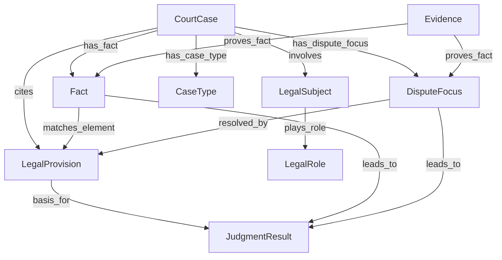

# 判决推理子图设计方案

> 版本: v1.0 | 日期: 2026-05-09 | 基于: legal_ontology_v2.yaml + guiding_case_extractor_v3 管线

---

## 一、背景与目标

当前法律知识图谱已完成指导性案例的LLM解析管线（平均分88.2），数据源包括裁判文书(txt)、指导性案例(CSV)、法条(待接入)。**核心用户需求**：从知识图谱中提取"案件判决相关推理"的子图，即已知案件事实(`basic_facts`)的情况下，结合要素(争议焦点/事实)、证据(类型/采信状态)、法条(构成要件)等实体关系属性来推理判决结果。

---

## 二、判决推理的最小可行子图（MVP Subgraph）

### 2.1 核心实体筛选

从 `legal_ontology_v2.yaml` 的40+实体中筛选出以下**9个核心实体**，构成判决推理的MVS（Minimum Viable Subgraph）：

| 序号 | 实体类型 | 本体中名称 | 判决推理中的角色 | 必要性 |
|------|----------|------------|------------------|--------|
| 1 | **法院案件** | `CourtCase` | 推理入口，聚合所有实体 | ★★★★★ |
| 2 | **事实/基本事实** | `Fact` + `case_summary.key_facts` | 推理起点，案件要素提取 | ★★★★★ |
| 3 | **争议焦点** | `DisputeFocus` (当前析出为 `case_summary.disputed_issues`) | 推理的推理链条中枢 | ★★★★★ |
| 4 | **法律条文** | `LegalProvision` | 推理依据/大前提 | ★★★★★ |
| 5 | **证据** | `Evidence` | 事实认定的支撑材料 | ★★★★★ |
| 6 | **裁判结果** | `JudgmentResult` | 推理结论/目标节点 | ★★★★★ |
| 7 | **法律主体** | `LegalSubject` (Person/Organization) | 权利义务承担者 | ★★★★ |
| 8 | **案由类型** | `CaseType` | 法律定性/推理方向 | ★★★★ |
| 9 | **裁判要旨/指导要点** | `GuidingCase.guiding_points` | 类案推理参考 | ★★★（仅指导性案例特有） |

**排除的实体及理由**：
- `Judge`/`Attorney`/`Prosecutor`/`TrialOrganization` → 程序性实体，与实质判决推理关系较弱
- `SentencingStandard` → 当前数据源未覆盖，且属于精细量化阶段（v3+）
- `ExecutionInfo` → 判决后执行阶段，非推理核心
- `LegalDocument` → 元数据层，不直接参与推理

### 2.2 关键属性筛选

#### CourtCase 案件属性
| 属性 | 字段路径 | 判决推理价值 | 当前提取质量 |
|------|---------|-------------|-------------|
| `case_number` | `case_number` | 身份标识，案件关联 | ✅ 良好(97%) |
| `trial_level` | `trial_level` | 推理审级背景 | ✅ 良好 |
| `cause_of_action` | (本体中有) | 法律关系定性 | ❌ 当前未提取 |
| `claim_amount` | (本体中有) | 标的金额范围 | ⚠️ 仅在case_summary中可推断 |
| `court` | `court.name` + `court.court_level` | 法院层级影响管辖/推理权威性 | ✅ 良好 |

#### Fact 事实属性
| 属性 | 当前提取源 | 判决推理价值 | 当前提取质量 |
|------|-----------|-------------|-------------|
| `key_facts` | `case_summary.key_facts` | ✅ 基本案情，推理输入 | ✅ 良好(score-5, 极少缺失) |
| `fact_type` | (未提取) | 无争议/有争议/待证事实 | ❌ 当前提取不到 |
| `proven_by_evidence_ids` | (未提取) | 事实→证据关联 | ❌ 当前提取不到 |

#### DisputeFocus 争议焦点
| 属性 | 当前提取源 | 判决推理价值 | 当前提取质量 |
|------|-----------|-------------|-------------|
| `disputed_issues` | `case_summary.disputed_issues` | ✅ **推理链条核心**，连接事实→法条→结论 | ✅ 良好(score-10, 极少缺失) |

#### LegalProvision 法律条文
| 属性 | 当前提取源 | 判决推理价值 | 当前提取质量 |
|------|-----------|-------------|-------------|
| `statute` | `statute` | 法律名称 | ✅ 良好 |
| `article` | `article` | 法条编号 | ✅ 良好 |
| `content` | `content` (含fallback) | ✅ 法条原文/摘要，**推理大前提** | ⚠️ 部分为fallback填充，非原文 |
| `citation_purpose` | `citation_purpose` | ✅ 适用/说理/反驳依据 | ✅ v3新增字段，质量待验证 |
| `citation_position` | `citation_position` | 推理上下文位置 | ✅ 良好 |

#### Evidence 证据
| 属性 | 当前提取源 | 判决推理价值 | 当前提取质量 |
|------|-----------|-------------|-------------|
| `content` | `content` | 证据内容摘要 | ✅ 良好 |
| `evidence_type` | `evidence_type` | 证据类型（书证/物证等） | ✅ 良好 |
| `submitted_by` | `submitted_by` | 举证方 | ✅ 良好 |
| **`examination_status`** | ❌ 未提取 | 是否经质证 | ❌ **关键缺失** |
| **`admission_status`** | ❌ 未提取 | **是否被采信** | ❌ **关键缺失（判决推理核心）** |
| **`probative_force`** | ❌ 未提取 | 证明力大小 | ❌ 未提取 |
| `is_key_evidence` | `is_key_evidence` | 是否关键定案证据 | ✅ 良好 |

#### JudgmentResult 裁判结果
| 属性 | 当前提取源 | 判决推理价值 | 当前提取质量 |
|------|-----------|-------------|-------------|
| `result_type` | `result_type` | ✅ 判决类型（有罪/赔偿等） | ✅ 良好 |
| `specific_judgment` | `specific_judgment` | ✅ 具体判决内容/金额 | ✅ 良好 |
| **`reasoning`** | ❌ 当前schema无此字段 | 法院推理过程 | ❌ **关键缺失**（本体`JudgmentResult`有`reasoning`可选字段，但当前prompt schema未纳入） |

### 2.3 实体间关系定义

以下是判决推理子图的核心关系类型。**加粗**为对"判决定理"关键路径：



| 关系名 | 源→目标 | 判决推理意义 | 本体已定义 | 当前提取 |
|--------|---------|-------------|----------|---------|
| **`cites`** | `CourtCase` → `LegalProvision` | 案件适用法条依据 | ✅ `cites` | ✅ 通过`legal_provisions[].case_number`关联 |
| **`judgment_cites`** | `JudgmentResult` → `LegalProvision` | 裁判结果依据法条 | ✅ `judgment_cites` | ❌ 当前未建立 |
| **`proves_fact`** | `Evidence` → `Fact` / `DisputeFocus` | 证据→事实/争议焦点 | ✅ `proves_fact` | ❌ 当前未提取 |
| **`has_dispute_focus`** | `CourtCase` → `DisputeFocus` | 案件争议焦点 | ✅ `has_dispute_focus` | ⚠️ 仅通过case_summary文本 |
| **`has_fact`** | `CourtCase` → `Fact` | 案件基本事实 | ✅ `has_fact` | ⚠️ 仅通过case_summary文本 |
| `submitted_for` | `Evidence` → `CourtCase` | 证据归属案件 | ✅ `submitted_for` | ⚠️ 隐式关联 |
| `has_case_type` | `CourtCase` → `CaseType` | 法律定性 | ✅ `has_case_type` | ✅ 良好 |
| `plays_role` | `LegalSubject` → `LegalRole` | 法律主体角色 | ✅ `plays_role` | ✅ 通过`legal_subjects[].roles` |
| **`matches_element`** | `Fact` → `LegalProvision` | 事实匹配法条构成要件 | ❌ **未定义** | ❌ |
| **`resolved_by`** | `DisputeFocus` → `LegalProvision` | 争议焦点由某法条解决 | ❌ **未定义** | ❌ |
| **`leads_to`** | `Fact`/`DisputeFocus` → `JudgmentResult` | 事实/焦点推导出判决 | ❌ **未定义** | ❌ |

---

## 三、从当前解析结果生成子图的方式

### 3.1 子图生成流程

当前LLM解析输出（扁平JSON）→ **子图构建器** → **判决推理子图**（存Neo4j）

```
[LLM解析输出] 
  ├─ guiding_case
  ├─ case_type
  ├─ court_cases[]          ──┐
  ├─ legal_subjects[]       ──┤──→ Subgraph Builder
  ├─ legal_provisions[]     ──┤     (后处理Pipeline)
  ├─ evidence[]             ──┤
  ├─ judgment_results[]     ──┘
  ├─ case_summary           ──→ 拆解为 Fact + DisputeFocus
  └─ judges/attorneys/...     (排除，不进入推理子图)
```

### 3.2 实体ID生成策略

采用**确定型UUID生成**确保可重复性：

```
ID格式: 实体类型前缀 + 案件ID + 序号
  - CourtCase:    CASE_{案号MD5前8位}
  - LegalProvision: LAW_{statute}_{article}_{case_id_hash}
  - Evidence:     EVID_{row_id}_{idx}
  - Fact:         FACT_{row_id}_{idx} (key_facts)
  - DisputeFocus:  DF_{row_id}_{idx} (disputed_issues)
  - LegalSubject:  SUBJ_{name_hash}
  - JudgmentResult: JR_{case_id_hash}_{idx}
  - CaseType:     CT_{category}_{level1}_{level2}
```

**原则**：
- 相同输入产生相同ID（幂等性）
- 跨案件唯一
- 便于溯源回原始解析结果

### 3.3 后处理步骤（无需额外LLM调用）

#### Step 1: 实体节点生成（规则提取，无需LLM）

从当前扁平的JSON输出到图节点的映射规则：

| 目标实体 | 源数据路径 | 提取规则 | 复杂度 |
|----------|-----------|---------|--------|
| `CourtCase` | `output.court_cases[]` | 直接映射，补充`cause_of_action`从`case_type`推断 | 低 |
| `LegalProvision` | `output.legal_provisions[]` | 直接映射 | 低 |
| `Evidence` | `output.evidence[]` | 直接映射 | 低 |
| `JudgmentResult` | `output.judgment_results[]` | 直接映射 | 低 |
| `LegalSubject` | `output.legal_subjects[]` | 直接映射 | 低 |
| `DisputeFocus` | `output.case_summary.disputed_issues` | 按编号/分号拆分为多个节点 | 低 |
| `Fact` | `output.case_summary.key_facts` | 单节点，提取事实要素 | 中 |
| `CaseType` | `output.case_type` | 直接映射 | 低 |

#### Step 2: 关系抽取（规则为主，可选LLM增强）

| 目标关系 | 源数据 | 提取方法 | 是否需要LLM |
|----------|--------|---------|------------|
| `CourtCase -[cites]-> LegalProvision` | `legal_provision.case_number`匹配 | 字符串匹配关联 | ❌ 无需 |
| `CourtCase -[has_case_type]-> CaseType` | 输出顶层case_type字段 | 直接关联 | ❌ 无需 |
| `LegalSubject -[plays_role]-> LegalRole` | `legal_subjects[].roles[].case_number` | 字符串匹配关联 | ❌ 无需 |
| `Evidence -[submitted_for]-> CourtCase` | 隐式：同属一个row的court_cases[0] | 默认关联到主案号 | ❌ 无需 |
| `JudgmentResult -[judgment_cites]-> LegalProvision` | `legal_provision.case_number` + judgment_result同案号 | 案号匹配 + 同篇上下文 | ❌ 无需 |
| `CourtCase -[has_fact]-> Fact` | `case_summary.key_facts` → Fact节点 | 1:1关联 | ❌ 无需 |
| `CourtCase -[has_dispute_focus]-> DisputeFocus` | `case_summary.disputed_issues` → DF节点 | 1:N关联 | ❌ 无需 |
| `Fact -[leads_to]-> JudgmentResult` | 同case内 | 默认关联（同case中最直接关联） | ❌ 无需 |
| `DisputeFocus -[leads_to]-> JudgmentResult` | 同case内 | 默认关联 | ❌ 无需 |
| **`Evidence -[proves_fact]-> Fact`** | 当前未提取 | **需要从裁判理由中解析** | ⚠️ **推荐LLM辅助** |
| **`Fact -[matches_element]-> LegalProvision`** | 当前未提取 | **法律构成要件匹配推理** | ⚠️ **推荐LLM辅助** |
| **`DisputeFocus -[resolved_by]-> LegalProvision`** | 当前未提取 | **争议焦点→法条映射** | ⚠️ **推荐LLM辅助** |

#### Step 3: 关系抽取的高级策略（标注3个⚠️的关系）

对于`proves_fact`、`matches_element`、`resolved_by`这三个高级关系，推荐采用**两种策略**：

**策略A（推荐，MVP阶段）**：
- 不做LLM重调用，基于规则做**弱关联**
- `Evidence` → `CourtCase` 关联后，通过`same_case`推理路径间接关联
- 不直接建立`proves_fact`边，而是通过查询时推理

**策略B（v2增强阶段）**：
- 使用**轻量LLM调用**，每次推理请求传入证据列表+事实+争议焦点文本
- LLM输出证据-事实关联矩阵（JSON格式，如 `{"proves": [{"evidence_idx": 0, "fact_idx": 1}]}`）
- 不修改主提取管线，作为独立的**关系后处理步骤**运行

### 3.4 Pipeline集成方案

```
提取管线（现有）
  └→ extracted_v4_*.jsonl
       ↓
  子图构建器（新增模块） → subgraph_builder.py
       ├─ Step 1: 实体节点生成（parse_entities_from_extraction）
       ├─ Step 2: 简单关系抽取（parse_relations_simple） 
       └─ Step 3: 高级关系抽取（parse_relations_advanced） ← 可选，批量LLM
              ↓
  Neo4j导入 → cypher/import_subgraph.cypher
       ↓
  判决推理子图（Neo4j存储）
```

**实施推荐**：
- **P0（MVP，1周）**：实现Step 1 + Step 2，完成实体节点+简单关系
- **P1（2周）**：实现Step 3 高级关系抽取（批量LLM模式）
- **P2（3周）**：子图查询API与判决推理服务

---

## 四、当前本体的覆盖盲区与版本升级建议

### 4.1 判决推理所需但当前本体缺失的实体/关系

| 缺失项 | 类型 | 重要性 | 说明 |
|--------|------|--------|------|
| **法律关系定性** | 实体属性 | ★★★★★ | `CourtCase`的`cause_of_action`已定义但未启用。当前解析结果中仅能从`case_type.level1`推断，但属于案由分类而非法律关系定性 |
| **法条构成要件元素** | 实体/关系 | ★★★★ | 法条由构成要件+法律效果组成，推理需要将事实匹配到构成要件要素。当前本体`LegalProvision`只有`content`字段，无结构化的构成要件分解 |
| **事实-证据关联** | 关系 | ★★★★ | 当前`proves_fact`关系已定义但未提取。是"以事实为依据"的图基础 |
| **事实-法条构成要件匹配** | 关系 | ★★★★★ | `matches_element`关系未定义。这是三段论推理（事实→法律→结论）的大前提-小前提匹配关键 |
| **争议焦点-法条映射** | 关系 | ★★★★ | `resolved_by`关系未定义。争议焦点解决路径的显式化 |
| **推理路径** | 实体/属性 | ★★★★ | `JudgmentResult`的`reasoning`字段本体有定义但当前prompt schema未要求提取 |

### 4.2 当前LLM解析管线的提取盲区

| 字段 | 推理价值 | 提取问题 | 修复方式 |
|------|---------|---------|---------|
| **证据采信状态** (`admission_status`) | ★★★★★ 核心 | ❌ 当前Evidence提取字段仅4个（content/type/submitted_by/is_key），缺少admission_status和examination_status | Prompt schema新增字段，LLM已具备能力 |
| **证据质证状态** (`examination_status`) | ★★★★ | ❌ 同上 | Prompt schema新增字段 |
| **裁判推理过程** (`JudgmentResult.reasoning`) | ★★★★★ 核心 | ❌ 当前prompt schema未要求提取 | Prompt schema新增字段 |
| **法律关系定性** | ★★★★ | ❌ 无对应字段 | `court_cases[].cause_of_action` 启用 |
| **法条引用目的** (`citation_purpose`) | ★★★★ | ⚠️ v3新增，质量待验证 | 继续验证 |
| **事实类型** (`fact_type`: 无争议/有争议/待证) | ★★★★ | ❌ 未提取 | Prompt schema新增枚举 |
| **合议庭/法官信息** | ★ | ✅ 已提取但推理价值低 | 可排除出子图 |

### 4.3 本体版本升级建议（v2→v3）

#### 建议升级内容

**v3新增实体/关系**：

```yaml
# ---- v3 新增 ----

# 法条构成要件（新实体）
LegalProvisionElement:
  is_a: LegalNorm
  required: [provision_id, element_type]
  optional: [content, applicable_fact_pattern]
  element_type_enum: [subject_element, object_element, 
                      act_element, result_element,
                      causality_element, subjective_element,
                      legal_consequence, exception_clause]
  description: "法条构成要件要素（如是自然人/故意/造成严重后果等）"

# 新关系
matches_element:
  from: Fact
  to: LegalProvisionElement
  cardinality: many_to_many
  attributes: [match_score, match_reasoning]
  description: "案件事实匹配法条构成要件要素"

resolves_focus:
  from: LegalProvision
  to: DisputeFocus
  cardinality: many_to_many
  description: "法条作为争议焦点解决依据"

leads_to:
  from: [Fact, DisputeFocus]
  to: JudgmentResult
  cardinality: many_to_many
  description: "事实/争议焦点推导出裁判结果"
```

**v2既有实体字段增强**：

```yaml
# Evidence 增强字段
Evidence:
  optional追加:
    - examination_status  # 本体已有，prompt未用
    - admission_status    # 本体已有，prompt未用
    - probative_force     # 本体已有，prompt未用

# JudgmentResult 增强
JudgmentResult:
  optional追加:
    - reasoning           # 本体已有，prompt未用
    - elements_found      # 新字段：法院认定的事实要素列表

# CourtCase 增强
CourtCase:
  optional追加:
    - cause_of_action     # 已定义但未启用

# DisputeFocus 增强
DisputeFocus:
  optional追加:
    - resolved_by_provision_ids  # 新字段：关联法律条文
    - resolution_logic           # 新字段：法院解决逻辑
```

#### 升级策略建议

| 优先级 | 动作 | 影响范围 | 工作量 |
|--------|------|---------|--------|
| **P0** | Prompt schema补充：Evidence的admission_status/examination_status | prompt_renderer.py + prompt文件 | 2天 |
| **P0** | Prompt schema补充：JudgmentResult的reasoning字段 | prompt_renderer.py + prompt文件 | 1天 |
| **P1** | 子图构建器（后处理） | 新建subgraph_builder.py | 5天 |
| **P1** | 启用CourtCase.cause_of_action | prompt_renderer.py | 1天 |
| **P2** | 高级关系抽取（proves_fact, matches_element, resolved_by） | 新增relation_extractor.py | 5天 |
| **P3** | LegalProvisionElement实体（法条构成要件结构化） | 本体v3 + prompt + 后处理 | 8天 |
| **P3** | 存储对接（Neo4j导入） | 新增neo4j_client.py + cypher脚本 | 3天 |

**建议**：不急于发版v3本体。可以先在**prompt schema层面**补充缺失字段（admission_status, reasoning等），后处理层级做实体拆分和关系抽取。等子图MVP稳定运行后，再推动本体v3的正式发布。

---

## 五、实施路线图

```
Week 1-2 [MVP] ─────────────────────────────────────────────
  □ 子图构建器 v1：实体节点生成 + 简单关系（cites, has_case_type等）
  □ Prompt schema补充：Evidence admission_status/examination_status
  □ Prompt schema补充：JudgmentResult.reasoning
  □ 重新运行提取管线，更新解析结果

Week 3-4 [增强] ────────────────────────────────────────────
  □ 高级关系批量抽取（proves_fact, matches_element, resolved_by）
  □ DisputeFocus拆分为独立节点 + has_dispute_focus关系
  □ Fact拆分为独立节点 + has_fact关系

Week 5-6 [查询层] ─────────────────────────────────────────
  □ Neo4j子图存储对接
  □ 判决推理查询接口（cypher模板）
  □ 子图可视化验证

Week 7-8 [迭代] ───────────────────────────────────────────
  □ 法条构成要件结构化（LegalProvisionElement）
  □ 本体v3版本正式发布
  □ 端到端推理链路评估
```

---

## 六、风险与注意事项

1. **证据采信状态的LLM提取质量风险**：裁判文书中证据采信状态的表述方式多样（"予以确认"、"不予采信"、"经庭审质证"等），LLM提取准确率可能在70-80%，需要设置后处理规则兜底（如正则+关键词匹配）。

2. **法条构成要件结构化是高难度任务**：需将自然语言的法条内容分解为结构化要素（主体/行为/结果/因果关系等），需要领域专家标注训练数据或设计few-shot prompt。

3. **不破坏现有提取管线**：所有子图构建的改动应在**后处理层级**进行，不修改核心LLM提取管线逻辑，确保现有88.2平均分不受影响。

4. **评估指标体系拓展**：当前评估只覆盖字段完备性（score计算），需要新增子图结构性指标（如边密度、推理路径完整性、实体关联度）。

5. **增量更新策略**：子图应支持增量追加（新案件解析结果仅影响新增子图部分），本体`legal_ontology_v2.yaml`的`incremental_update: true`需在子图构建中贯彻。

---

## 七、附录：判决推理子图数据模型（Cypher Schema）

```cypher
// 节点标签
:CourtCase {
  case_number: string,
  trial_level: string,
  filing_date: date,
  cause_of_action: string     // v3启用
}

:LegalProvision {
  statute: string,
  article: string,
  content: string,
  citation_purpose: string
}

:Evidence {
  content: string,
  evidence_type: string,
  admission_status: string,   // v3新增
  examination_status: string, // v3新增
  is_key_evidence: boolean
}

:Fact {
  content: string,
  fact_type: string            // undisputed/disputed/to_be_proven
}

:DisputeFocus {
  content: string,
  focus_category: string
}

:JudgmentResult {
  result_type: string,
  specific_judgment: string,
  reasoning: string            // v3新增
}

:LegalSubject {
  name: string,
  subject_type: string
}

:LegalRole {
  name: string,
  code: string
}

:CaseType {
  category: string,
  level1: string,
  level2: string
}

// 关系类型
[:CITES]           // CourtCase → LegalProvision
[:JUDGMENT_CITES]  // JudgmentResult → LegalProvision
[:HAS_FACT]        // CourtCase → Fact
[:HAS_DISPUTE]     // CourtCase → DisputeFocus
[:PROVES_FACT]     // Evidence → Fact|DisputeFocus
[:MATCHES_ELEMENT] // Fact → LegalProvisionElement (v3)
[:LEADS_TO]        // Fact|DisputeFocus → JudgmentResult
[:PLAYS_ROLE]      // LegalSubject → LegalRole (with case_id attribute)
[:SUBMITTED_FOR]   // Evidence → CourtCase
[:HAS_CASE_TYPE]   // CourtCase → CaseType
```
